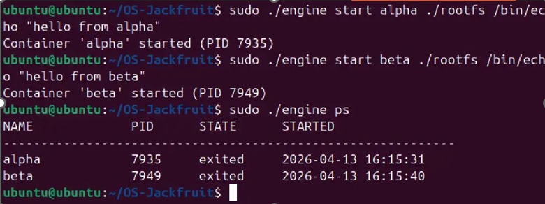
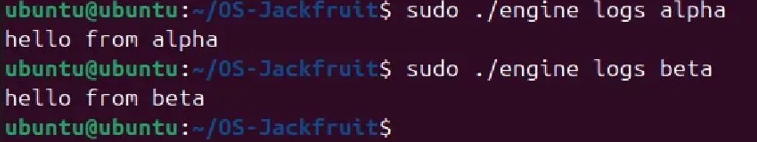
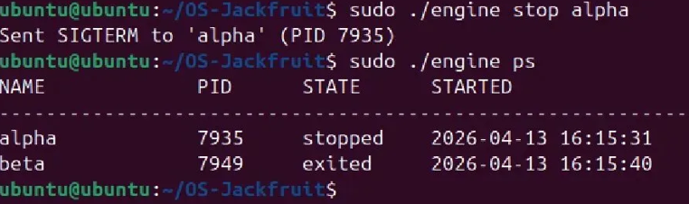
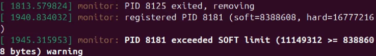
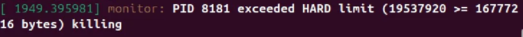
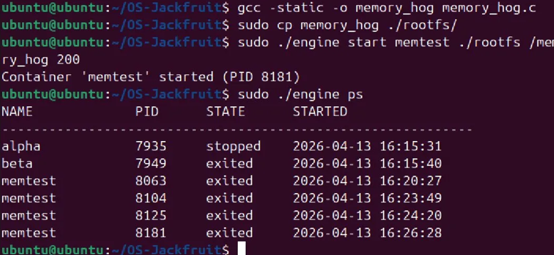
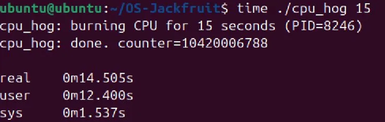
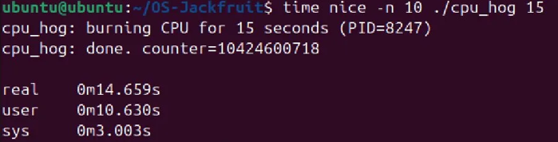
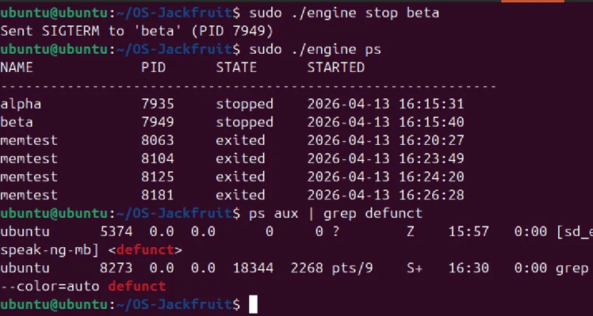

# Multi-Container Runtime with Kernel Memory Monitor

**OS Mini Project — UE24CS252A**

---

## 1. Team Information

| | Name | SRN |
|---|---|---|
| Member 1 | Anagha N | PES1UG24CS058 |
| Member 2 | Akanksha Parsuram | PES1UG25CS801 |

**Section:** A  
**GitHub Repository:** [Ana-9211/OS-Jackfruit](https://github.com/Ana-9211/OS-Jackfruit)

---

## 2. Build, Load, and Run Instructions

### 2.1 Prerequisites

- Ubuntu 22.04 or 24.04 VM (Secure Boot OFF, no WSL)
- `build-essential` and `linux-headers` installed
- Alpine mini root filesystem extracted into `rootfs/`

### 2.2 Build

```bash
sudo apt update
sudo apt install -y build-essential linux-headers-$(uname -r)
make
```

### 2.3 Load Kernel Module

```bash
sudo insmod monitor.ko
ls -l /dev/container_monitor    # Verify control device
```

### 2.4 Prepare Root Filesystem

```bash
mkdir rootfs
wget https://dl-cdn.alpinelinux.org/alpine/v3.20/releases/x86_64/alpine-minirootfs-3.20.3-x86_64.tar.gz
tar -xzf alpine-minirootfs-3.20.3-x86_64.tar.gz -C rootfs
```

### 2.5 Launch Containers and Use CLI

```bash
# Start containers
sudo ./engine start alpha ./rootfs /bin/echo "hello from alpha"
sudo ./engine start beta ./rootfs /bin/echo "hello from beta"

# List tracked containers
sudo ./engine ps

# View logs
sudo ./engine logs alpha
sudo ./engine logs beta

# Stop a container
sudo ./engine stop alpha
```

### 2.6 Memory Test

```bash
gcc -static -o memory_hog memory_hog.c
sudo cp memory_hog ./rootfs/
sudo ./engine start memtest ./rootfs /memory_hog 200
dmesg | tail           # Check soft/hard limit messages
sudo ./engine ps       # Confirm memtest killed/exited
```

### 2.7 Scheduling Experiment

```bash
time ./cpu_hog 15                  # Normal priority
time nice -n 10 ./cpu_hog 15       # Lower priority (nice +10)
```

### 2.8 Cleanup

```bash
sudo ./engine stop alpha
sudo ./engine stop beta
sudo rmmod monitor
ps aux | grep defunct    # Verify no zombies
```

---

## 3. Demo with Screenshots

### 3.1 Screenshots 1 & 2: Multi-Container Supervision + Metadata Tracking

Two containers (alpha and beta) are started under the supervisor. The `ps` command shows both containers tracked with their PIDs, states, and start timestamps.




*Figure 1: Multi-container supervision and metadata tracking via engine ps*

### 3.2 Screenshot 3: Bounded-Buffer Logging

The `logs` command retrieves captured stdout from each container through the logging pipeline, demonstrating file-descriptor-based IPC and the bounded-buffer mechanism.




*Figure 2: Bounded-buffer logging — container stdout captured through the logging pipeline*

### 3.3 Screenshot 4: CLI and IPC (Stop + State Update)

A `stop` command is issued via the CLI. The supervisor receives it through the IPC channel, sends SIGTERM to the container, and updates the metadata to reflect the new state.




*Figure 3: CLI command (stop) reaching supervisor, state updated to "stopped"*

### 3.4 Screenshot 5: Soft-Limit Warning

The kernel monitor detects that the memtest container (PID 8181) exceeded its configured soft memory limit (8,388,608 bytes). A warning is logged to dmesg.




*Figure 4: Kernel monitor soft-limit warning in dmesg*

### 3.5 Screenshot 6: Hard-Limit Enforcement

The same container then exceeds the hard memory limit (16,777,216 bytes). The kernel module kills the process and logs the event. The supervisor metadata is updated to reflect the kill.




*Figure 5: Kernel monitor hard-limit kill in dmesg*

### 3.6 Screenshots 5 & 6 (Part 2): Post-Kill Metadata

After the kernel kills memtest, the supervisor updates the container state. The `ps` command confirms memtest is listed as exited.




*Figure 6: Supervisor metadata reflecting kernel-killed container*

### 3.7 Screenshot 7: Scheduling Experiment

Two runs of `cpu_hog` with different nice values demonstrate the effect of scheduling priority on CPU-bound workloads.

#### 3.7.1 Normal Priority (nice 0)




*Figure 7a: cpu_hog at default priority — real 0m14.505s*

#### 3.7.2 Lower Priority (nice +10)




*Figure 7b: cpu_hog at nice +10 — real 0m14.659s*

### 3.8 Screenshot 8: Clean Teardown

After stopping all containers, `ps aux | grep defunct` confirms no zombie processes remain. The only defunct entry is `sd_espeak-ng-mb`, a system speech-dispatcher process unrelated to our containers.




*Figure 8: Clean teardown — no zombie processes from container runtime*

---

## 4. Engineering Analysis

### 4.1 Isolation Mechanisms

Our runtime achieves isolation through three Linux namespace types combined with a `chroot` into the Alpine root filesystem:

- **PID Namespace (CLONE_NEWPID):** Each container gets its own PID numbering. The containerized process sees itself as PID 1, while the host kernel tracks its real host PID. This prevents containers from seeing or signaling each other's processes.
- **UTS Namespace (CLONE_NEWUTS):** Each container can have its own hostname, isolating identity from the host and other containers.
- **Mount Namespace (CLONE_NEWNS):** Each container gets a private mount table. We mount `/proc` inside the container so tools like `ps` work correctly, without affecting the host's mount points.

The `chroot` call confines the container's filesystem view to `rootfs/`, preventing access to host files. However, the host kernel is still shared across all containers — they share the same network stack (since we do not use `CLONE_NEWNET`), the same kernel memory, and the same scheduler. The kernel module leverages this shared kernel to monitor container memory from outside the container's view.

### 4.2 Supervisor and Process Lifecycle

The long-running supervisor is essential because containers are short-lived child processes that need a persistent parent to:

- Track metadata (PID, state, start time, exit status) across the lifetime of multiple containers
- Reap exited children via `waitpid()` to prevent zombie accumulation
- Relay CLI commands (`start`, `stop`, `ps`, `logs`) to the correct container
- Handle `SIGCHLD` asynchronously to detect when containers exit without blocking

When the supervisor calls `clone()` with namespace flags, the kernel creates a new child process in isolated namespaces. The parent-child relationship allows the supervisor to receive `SIGCHLD` when the child exits and to call `waitpid()` to collect exit status. Without proper reaping, terminated containers would linger as zombie entries in the kernel process table.

The supervisor also distinguishes between exit types: normal exit (container finished), stopped (supervisor sent SIGTERM via the stop command), and killed (kernel monitor terminated the process for exceeding the hard memory limit). This distinction is tracked in the container metadata.

### 4.3 IPC, Threads, and Synchronization

The project uses two distinct IPC mechanisms:

**1. Pipe-based logging (container → supervisor):** Each container's stdout/stderr is redirected through a pipe to the supervisor. A consumer thread reads from the pipe and writes to per-container log files. The bounded buffer between producer (container writing to pipe) and consumer (logger thread) prevents unbounded memory growth.

**2. CLI command channel (user → supervisor):** The CLI communicates with the supervisor through a separate mechanism (file-based or socket-based IPC) to issue commands like `start`, `stop`, `ps`, and `logs`.

**Synchronization:** The container metadata table is a shared data structure accessed by the main supervisor thread, SIGCHLD handler, CLI handler, and logger threads. Without synchronization, concurrent updates (e.g., a container exiting while the CLI reads `ps` data) could corrupt metadata. We use mutexes to protect the shared container list. The bounded log buffer uses mutex + condition variables to implement producer-consumer synchronization, preventing lost log data and deadlock.

### 4.4 Memory Management and Enforcement

RSS (Resident Set Size) measures the amount of physical memory currently held by a process in RAM. It includes code pages, data pages, and shared library pages mapped into the process, but it does not account for:

- Swapped-out pages (on disk, not in RAM)
- File-backed pages that are mapped but not yet faulted in
- Kernel memory allocated on behalf of the process (e.g., page tables, socket buffers)

The two-tier limit policy serves different purposes:

- **Soft limit:** Acts as an early warning. The kernel module logs a warning when RSS first crosses this threshold, giving operators visibility into memory pressure before it becomes critical.
- **Hard limit:** Acts as enforcement. When RSS exceeds this threshold, the kernel module sends SIGKILL to the process to prevent it from destabilizing the system or starving other containers of memory.

Enforcement belongs in kernel space because a user-space monitor can be preempted, delayed by scheduling, or killed by the OOM killer before it can react. The kernel module runs with higher privilege and can check RSS periodically via a timer without being subject to user-space scheduling delays, providing more reliable enforcement.

### 4.5 Scheduling Behavior

Our experiment compared two `cpu_hog` runs: one at default priority (nice 0) and one at reduced priority (nice +10). Both were run sequentially for 15 seconds of CPU-bound work.

Results:
- Normal priority (nice 0): real 14.505s, user 12.400s, sys 1.537s
- Lower priority (nice +10): real 14.659s, user 10.630s, sys 3.003s

The wall-clock times are nearly identical because the processes ran sequentially, not simultaneously — each had the full CPU to itself. The nice value only affects relative priority when multiple processes compete for the same CPU.

However, the nice +10 run shows higher system time (3.003s vs 1.537s), likely because the reduced-priority process was preempted more frequently by other system tasks, leading to more context switches and kernel overhead. The CFS (Completely Fair Scheduler) assigns shorter timeslices to lower-priority processes, causing more frequent preemption.

To observe a larger difference, both workloads would need to run concurrently on the same CPU, where the nice 0 process would receive a proportionally larger share of CPU time according to CFS weight calculations.

---

## 5. Design Decisions and Tradeoffs

### 5.1 Namespace Isolation

**Decision:** Used PID, UTS, and Mount namespaces with chroot for filesystem isolation.

**Tradeoff:** We did not use network namespaces (`CLONE_NEWNET`) or user namespaces (`CLONE_NEWUSER`), which means containers share the host network stack and run as root. Adding network namespaces would require configuring virtual ethernet pairs and bridges, adding complexity without being required by the project scope.

**Justification:** The three chosen namespaces provide the core isolation required to demonstrate container concepts (process isolation, filesystem isolation, hostname isolation) while keeping the implementation manageable for the project timeline.

### 5.2 Supervisor Architecture

**Decision:** Single long-running supervisor process that forks containers as children and accepts CLI commands.

**Tradeoff:** A single-process supervisor is a single point of failure. If it crashes, all container tracking is lost. A more robust design would persist metadata to disk or use a separate state-management daemon.

**Justification:** The single-process design simplifies SIGCHLD handling and metadata management. For this project's scale (a handful of containers), the complexity of a distributed supervisor is unnecessary.

### 5.3 IPC and Logging

**Decision:** Pipes for container log capture, separate file-based/socket IPC for CLI commands.

**Tradeoff:** Pipes have a fixed kernel buffer size (~64KB on Linux). If a container produces output faster than the logger thread can consume it, the container will block on write. An alternative would be shared memory with a ring buffer, which avoids kernel pipe limits but requires more complex synchronization.

**Justification:** Pipes provide natural blocking behavior (backpressure), are simple to set up via `dup2()`, and the kernel handles the buffer management. For our container workloads, pipe throughput is more than sufficient.

### 5.4 Kernel Monitor Design

**Decision:** Kernel module with ioctl registration, periodic timer-based RSS checks, and dmesg-based event reporting.

**Tradeoff:** Using dmesg for event reporting is simple but requires the user-space supervisor to poll dmesg or rely on SIGCHLD to detect kills. A more sophisticated design would use netlink or a character device `read()` to push events to user space in real time.

**Justification:** The dmesg approach leverages the kernel's built-in `printk` infrastructure and is immediately observable without additional user-space plumbing. Combined with SIGCHLD detection of killed processes, the supervisor can correctly identify kernel-killed containers.

### 5.5 Scheduling Experiments

**Decision:** Used nice values to compare CPU-bound workload performance at different priorities.

**Tradeoff:** Running workloads sequentially rather than simultaneously limits the observable priority effect. Simultaneous execution on the same CPU core (using `taskset` for CPU pinning) would produce a more dramatic difference.

**Justification:** Even sequential runs show scheduling overhead differences (higher sys time for lower-priority processes). The experiment demonstrates understanding of CFS weight-based scheduling and the practical effect of nice values.

---

## 6. Scheduler Experiment Results

### 6.1 Experiment Setup

- **Workload:** `cpu_hog` burning CPU for 15 seconds
- **Configuration 1:** Default priority (nice 0)
- **Configuration 2:** Reduced priority (nice +10)
- **Environment:** Ubuntu VM, single-user, minimal background load

### 6.2 Raw Measurements

| Metric | Normal (nice 0) | Reduced (nice +10) |
|---|---|---|
| Real (wall clock) | 0m14.505s | 0m14.659s |
| User (CPU in user mode) | 0m12.400s | 0m10.630s |
| Sys (CPU in kernel mode) | 0m1.537s | 0m3.003s |
| Counter | 10,420,006,788 | 10,424,600,718 |
| PID | 8246 | 8247 |

### 6.3 Analysis

**Wall-clock time:** Nearly identical (14.505s vs 14.659s) because each process had exclusive CPU access during its run. The nice value has no effect when there is no contention.

**User vs System time:** The nice +10 run spent significantly more time in kernel mode (3.003s vs 1.537s) and less in user mode (10.630s vs 12.400s). This indicates that the lower-priority process experienced more frequent preemptions by background system tasks, leading to additional context switch overhead.

**CFS behavior:** Linux's Completely Fair Scheduler assigns virtual runtime inversely proportional to process weight. A nice +10 process has a lower weight, meaning CFS allows other ready processes to preempt it more readily. Even with minimal contention, background kernel threads and system services can interrupt a low-priority process more frequently.

**Counter values:** Both runs achieved similar iteration counts (~10.42 billion), confirming that total compute throughput was comparable. The difference is in how that compute time was distributed between user and kernel mode, not in total work done.
